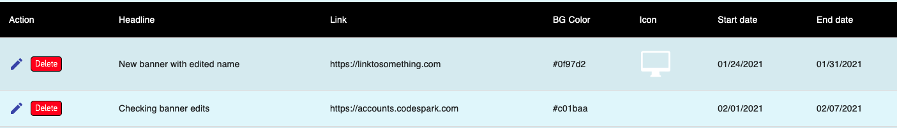

# codeSpark Sample Banner App

This app was created using create-react-app for the front-end and Mirage JS for mocking out the API. Although you are welcome to use any framework or library to complete this task, we have provided this basic structure as a starting point should you wish to use it. 

To run this app, you will need to install the dependencies, then start the app using either `npm start` or `yarn start`.

All source files are located in the /src folder. Front-end component files are located within that folder under /components. The structure for the API is located inside the `server.js` file. 

## Scenario
The purpose of this app is to display a collection of banner objects and allow a user to add, update, or delete from that collection. How you choose to do that is up to you. The setup for the mock data and the API is in `server.js`. The setup for the client is in /components/App.js.

At a minimum the app should be able to run and do the following tasks:
  <ul>
  <li>fetch and display all the banner objects</li>
  <li>ability to add a new banner object</li>
  <li>ability to edit an existing banner object</li>
  <li>ability to remove an existing banner object</li>
  </ul>

Bonus points if the app also:
  <ul>
  <li>alerts the user if they were successful/unsuccessful in adding/editing/deleting</li>
  </ul>

It is entirely up to you how you want to display and set up this app. We've included Material-UI as one of the dependencies but you are not required to use it. Feel free to mix and match and change the code to suit how you would like it.  

An example of what can be done might look something like this:

### If you have any questions, please reach out!# HOMER
